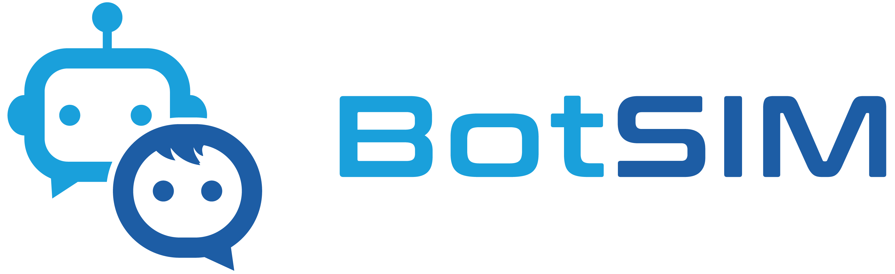

<p align="center">
    <br>
    
    <br>
<p>

<div align="center">
  <a href="https://github.com/salesforce/botsim/releases"></a>
  <a href="https://opensource.salesforce.com/botsim/index.html">
  
  <a href="https://opensource.org/licenses/BSD-3-Clause">
  
  </a>
</div>

<div align="center">
<a href="https://arxiv.org/abs/2211.11982">System Description</a>,
<a href="https://arxiv.org/abs/2211.15916">Technical Report</a>,
<a href="https://salesforce-botsim.herokuapp.com/">Demo</a>,
<a href="https://opensource.salesforce.com/botsim//latest/index.html">Documentation</a>,
<a href="https://blog.salesforceairesearch.com/botsim/">Blog</a>
</div>


# BotSIM:  An End-to-End Bot Simulation Toolkit for Commercial Task-Oriented Dialog Systems


## Table of Contents
1. [Introduction](#introduction)
2. [Installation](#installation)
3. [Getting Started](#getting-started)
4. [Tutorials](#tutorial)
4. [Documentation](#documentation)
5. [System Demo Paper and Technical Report](#system-demo-paper-and-technical-report)


## Introduction
BotSIM is an open-source Bot SIMulation toolkit for large-scale data-efficient end-to-end evaluation, diagnosis and remediation of commercial task-oriented dialog systems (chatbots) across muliple bot platforms. 
This toolkit aims to provide bot developers and practitioners with a one-stop solution to accelerate bot development and evaluation, reduce cost and time-to-market.
As a modular framework, BotSIM can be extended by bot developers to support new bot platforms. As a toolkit, BotSIM offers an easy-to-use App and a suite of command line tools for bot practitioners to readily apply BotSIM's "generation-simulation-remediation" pipeline. 

Key features of BotSIM include:

- **Multi-stage bot evaluation**: BotSIM can be used for both pre-deployment testing and potentially post-deployment performance monitoring.
- **Data-efficient dialogue generation**: Equipped with a deep network based paraphrasing model, BotSIM can generate an extensive set of test intent queries from the limited number of input intent utterances, which can be used to evaluate the bot intent model at scale.
- **End-to-end bot evaluation via dialogue simulation**: Through automatic chatbot simulation, BotSIM can identify existing issues of the bot and evaluate both the natural language understanding (NLU) performance and the end-to-end dialogue performance such as goal completion rates.
- **Bot health report dashboard**: The bot health report dashboard presents a multi-granularity top-down view of bot performance. Together with the analytical tools, they help bot practitioners quickly diagnose and troubleshoot their bots.
- **Easy extension to new bot platform**: BotSIM can be easily extended to support new bot platforms. BotSIM currently supports  [Salesforce Einstein BotBuilder](https://help.salesforce.com/s/articleView?id=sf.bots_service_intro.htm&type=5) and [Google DialogFlow CX](https://cloud.google.com/dialogflow/cx/docs/basics)


## Prerequisite 
To use BotSIM, users need to have API access to the following supported bot platforms:
- Salesforce EinsteinBotBuilder LiveAgent API: `org ID`, `button ID`, `deployment Id`, `chat endpoint`
- Google DialogFlow CX API: `location ID`, `project ID`, `agent ID` and JSON API token

## Installation
1. (Optional) Creating conda environment
```bash
   conda create -n botsim python=3.9
   conda activate botsim
```

2. Cloning and building dependencies
``` bash
   git clone https://github.com/salesforce/botsim.git
   cd botsim
   pip install .
```

## Getting Started

### Streamlit Web App
The most straightforward way of getting started with BotSIM is the Streamlit Web App. 
The multi-page App is developed to guide users to leverage BotSIM's "generation-simulation-remediation" pipeline for evaluation, diagnosis and remediation of their bots.     
<p align="center" width="100%">
    
</p>


The following commands can be used to start the Streamlit Web App locally:
```bash
  export PYTHONPATH=./:$PYTHONPATH
  export DATABASE_URL="db/botsim_sqlite_demo.db"
  streamlit run botsim/streamlit_app/app.py
```
The App can also be deployed to GCP for access to GPU resources. Detailed deployment instructions are given in the [GCP Deployment](https://opensource.salesforce.com/botsim//latest/advanced_usage.html#gcp-deployment) section of the documentation.

### Command Line Tools
Alternatively, users can also deep-dive to learn more about BotSIM's system components through the command line tools. Details are given in the [tutorial section](https://opensource.salesforce.com/botsim//latest/tutorials.html#botsim-command-line-tools) of the [code documentation](https://opensource.salesforce.com/botsim//latest/index.html#).

## Tutorial
We provide the following tutorials in the [code documentation](https://opensource.salesforce.com/botsim//latest/tutorials.html). 
- [Streamlit Web App](https://opensource.salesforce.com/botsim//latest/tutorials.html#streamlit-web-app)
- [Command Line Tools](https://opensource.salesforce.com/botsim//latest/tutorials.html#botsim-command-line-tools)
- [Bot Health Dashboard Navigation](https://opensource.salesforce.com/botsim//latest/dashboard.html)
- [Applying Remedidation Suggestions](https://opensource.salesforce.com/botsim//latest/dashboard.html#apply-intent-model-remediation-suggestions)

## Documentation 
For more details of the [system components](https://opensource.salesforce.com/botsim/latest/deep_dive.html) and [advanced usages](https://opensource.salesforce.com/botsim//latest/advanced_usage.html), please refer to the [code documentation](https://opensource.salesforce.com/botsim//latest/index.html#).
We welcome the contribution from the open-source community to improve BotSIM. To support new bot platforms, please also follow the [guidelines](https://opensource.salesforce.com/botsim/latest/advanced_usage.html) detailed in the code documentation.

## System Demo and Technical Report
A dashboard demo of the Streamlit App can be accessed [here](https://salesforce-botsim.herokuapp.com/).
You can find more details regarding BotSIM designs in our technical report:
```
@article{guangsen2022-botsim-tr,
  author    = {Guangsen Wang and Junnan Li and Shafiq Joty and Steven Hoi},
  title     = {BotSIM: An End-to-End Bot Simulation Toolkit for Commercial Task-Oriented Dialog Systems},
  year      = {2022},
  url       = {https://arxiv.org/abs/2211.15916},
  archivePrefix = {arXiv},
}
```
The detailed system descriptions are presented in the following EMNLP 2022 system demo paper:
```
@article{guangsen2022-botsim-demo,
  author    = {Guangsen Wang and Samson Tan and Shafqi Joty and Gang Wu and Jimmy Au and Steven Hoi},
  title     = {BotSIM: An End-to-End Bot Simulation Framework for Commercial Task-Oriented Dialog Systems},
  year      = {2022},
  url       = {https://arxiv.org/abs/2211.11982},
  archivePrefix = {arXiv},
}
```
If you're using BotSIM in your research or applications, please cite the papers.
## Contact Us
Feel free to contact botsim@salesforce.com for any comments, issues or suggestions.

## License
[BSD 3-Clause License](LICENSE.txt)
