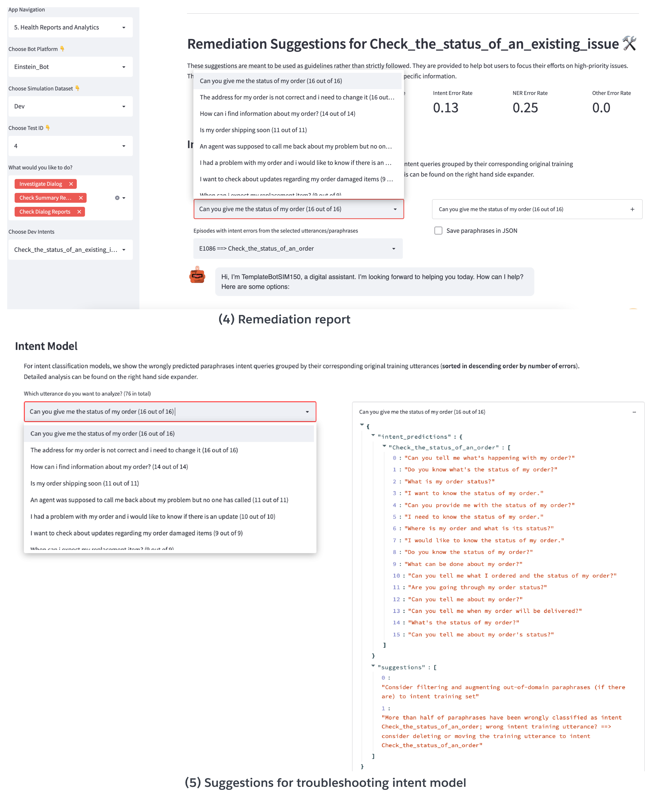

Remediator Dashboard Navigation
#####################################

Bot Health Reports
**************************************************************
The bot health dashboard consists of a set of multi-level performance reports. At the highest level, 
users can have a historical view of most recent simulation/test sessions (e.g., after each major bot update). 
The historical performance comparison can help users evaluate the impacts of bot changes quantitatively, 
from which they can make decisions like whether or not to keep certain changes.
In the session-specific performance summary, users can zoom in for more details of a selected test session 
including the data distribution, overall dialog performance metrics. Furthermore, one can select a dialog/intent of 
the specific testing session to investigate the detailed intent and NER performance in the dialog-specific performance summary. 
Through the dialog-specific performance report, one can quickly identify the most confusing intents and entities. 
This saves significant efforts and helps better allocation of resources for troubleshooting and bot improvement.

.. image:: _static/BotSIM_Performance_Report.png
  :width: 550

Remediation suggestions
**************************************************************
In addition to the diagnosis reports, the remediator also provides actionable insights/recommendations for users to remedy some of the identified issues.
The remediation dashboards given below allow detailed investigation of all intent or NER errors along with their corresponding simulated chat logs.
The root causes of the failed conversations are identified via backtracking of the simulation agenda.
For troubleshooting intent models, the remediator attempts to identify the intent utterances and paraphrases that are wrongly predicted by the current model. Depending on the wrongly classified intent classes, the remediator would suggest some follow-up actions including 1) augmenting the intent training set with the queries deemed to be out-of-domain by the current intent model, 2) moving the intent utterance to another intent if most of paraphrases of the former intent utterance are classified to the latter intent. 
Similarly for the NER model, the remediator collects all the wrongly extracted entities and the messages with such entities. Depending on the entity extraction method, users can follow the suggestions to troubleshooting or improving the bot NER capabilities.
Note the suggestions are meant to be used as guidelines rather than strictly followed. More importantly, users can always extend them to include domain expertise in troubleshooting bots related to their products/services.

.. image:: _static/Dashboard_NER_Remediation.png
  :width: 550

Conversational Analytics
**************************************************************
Another useful component of the Remediator is the suite of conversation analytical tools. They further help bot practitioners gain more insights for troubleshooting and 
improving their dialog systems. The confusion matrix analysis breaks down the intent model performance into (sortable) recall, precision and F1 accuracies to help identify the 
worse performing intents. Another useful analytical tool is the tSNE~clustering of the intent utterances using sentence transformer embeddings. The tSNE visualisation enables users 
to gauge the training data quality. It is also an effective tool in identifying overlapping intents and can potentially benefit new intent discovery as well.
Lastly, powered by parsers' conversation graph modelling capability, the dialog path explorer can be used to visualise different conversation flows of the current bot design. 
For example, users can select the source and target dialogs and investigate the generated dialog paths. Not only is the tool valuable for comprehensive testing coverage of conversation paths, 
it also offers a controllable approach to troubleshooting dialog design related errors or even improving the current design.

.. image:: _static/Dashboard_Analytics.png
  :width: 550

Apply Intent Model Remediation Suggestions
###########################################

The most straightforward approach of applying remediation suggestions is to augment the the recommended misclassified paraphrases  to the original
training set to retrain the intent model. 

For the Einstein BotBuilder platform, new intent sets can be created as a csv file for the augmented training set. The csv file can be deployed
to users' org via `Salesforce Workbench <https://workbench.developerforce.com/login.php>`_. The new intent model can be trained by associate the 
new intent set ``report_issue_dev_augmented`` with the ``Report an Issue`` intent.

.. csv-table:: Snippet of augmented intent set csv file for the Einstein BotBuilder Platform
   :file: augmented.csv
   :widths: 5,5,90
   :header-rows: 1

For DialogFlow CX, the recommended paraphrases can be add back to the corresponding training set and the intent model will be automatically retrained.

The table below shows the intent F1 score comparison before and after intent model retraining based on the simulation goals created from the same evaluation set.

.. list-table::
   :widths: 30 40 20 20 20 20 30
   :header-rows: 1

   * - **Model**
     - **Transfer to Agent**
     - **End Chat**
     - **Connect with sales**
     - **Check Issue Status**
     - **Check Order Status**
     - **Report an Issue**
   * - Baseline
     - 0.92
     - 0.95
     - 0.89 
     - 0.93 
     - 0.94
     - 0.82
   * - Retrained
     - 0.92
     - 0.97
     - 0.93
     - 0.95
     - 0.96
     - 0.87

We observe consistent improvements for all intents on the evaluation set   after model retraining. More challenging intents (lower F1s), e.g., "Report an Issue (RI)" and "Connect with Sales (CS)", 
saw larger performance gains compared to the easier ones such as "End Chat (EC)" (higher  F1s). This demonstrates the efficacy of BotSIM and is likely due to more paraphrases being selected 
for retraining the model on the more challenging intents.

.. list-table::
   :widths: 30 40 20 20 20 20 30
   :header-rows: 1

   * - **No. Training Utterances**
     - **Transfer to Agent**
     - **End Chat**
     - **Connect with sales**
     - **Check Issue Status**
     - **Check Order Status**
     - **Report an Issue**
   * - Original
     - 150
     - 150
     - 150 
     - 150 
     - 150
     - 150
   * - Augmented
     - 255
     - 184
     - 212
     - 268
     - 215
     - 294
    

