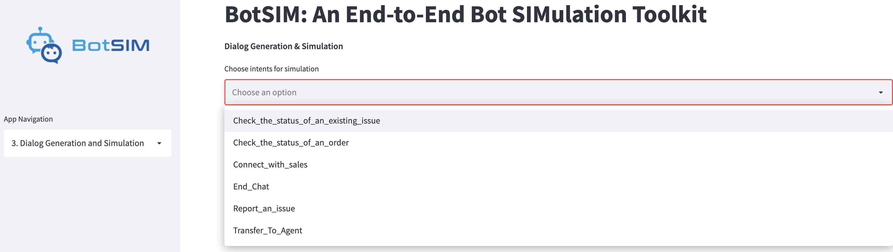

Retrieve Einstein BotBuilder Bot Metadata
##############################################################################
There are two inputs required by BotSIM for dialog simulation with the Einstein BotBuilder platform: 

1. ``botVersions`` metadata contains bot design related data such as dialog flows, bot messages,  entities, etc. It may also include  intent training utterances (e.g., if intent sets are not used). 
If intent sets are used, the ``botVersions`` metadata will connect each dialog intent to the intent sets used to train the intent.
The utterances in the intent sets are extracted from MlDomains metadata.
    
    .. code-block:: xml

       <?xml version="1.0" encoding="UTF-8"?>
       <Package xmlns="http://soap.sforce.com/2006/04/metadata">
        <types>
            <members>Your-Bot-API-Name</members>
            <name>Bot</name>
        </types>
        <version>51.0</version>
      </Package>

An example ``package.xml`` for extracting  the ``botVersions`` metadata of a bot named “Your-Bot-API-Name” is given above. 
The bot API name can be found under the bot “Overview” page. 
Replace “Your-Bot-API-Name” with the test bot API name and login to `Salesforce Workbench <https://workbench.developerforce.com/login.php>`_ 
to "retrieve" the “botVersions” metadata.
By default, the raw “botversion” XML metadata is downloaded and extracted as unpackaged/bot/<Your-Bot-API-Name>.bot. 
It is subsequently parsed to infer the dialog act maps to be used as BotSIM NLU model.

2. ``MlDomain`` metadata contains all intent sets. Each intent set comprises a set of training utterances that can be used to train (if NLP bot is enabled) certain intents. 
Like the previous metadata, a “package.xml” is needed to retrieve the metadata.

    .. code-block:: xml

       <?xml version="1.0" encoding="UTF-8"?>
       <Package xmlns="http://soap.sforce.com/2006/04/metadata">
        <types>
            <members>Your-Intent-Set-API-Name</members>
            <name>MlDomain</name>
        </types>
        <version>51.0</version>
      </Package>

The ``MLDomain`` metadata is extracted under  "unpackaged/mlDomains". The XML mlDomain metadata will be parsed to extract the training utterances for all intents. 

3. **[Optional] Preparing evaluation intent utterances.** The purpose of the evaluation set is to benchmark the bot performance after each bot update via  dialog simulation. By default, the evaluation set is created automatically by sampling a subset of the paraphrases from the intent training utterances. 
This is to enable BotSIM for pre-deployment evaluation without any customer data.
To test and monitor the intent model performance from real traffic,  an evaluation set can be created from production chat logs.  

Streamlit Web App
##############################################################################
BotSIM Streamlit App is a multi-page app developed to lower the entry barrier for applying BotSIM to bot evaluation and remediation. The Streamlit App frontend is supported
by the Python Flask API server running the following services:

- ``botsim_generation`` is the generation service to parse bot data, apply paraphrasing models and generate dialog goals
- ``botsim_simulation`` is the simulation service to perform agenda-based user simulation 
- ``botsim_remediation`` is the remediation service to perform analysis and aggregate dashboard reports

Next we will provide detailed instructions for using the App.

1. Simulation Setup
***********************
.. image:: _static/simulation_setup.png
  :width: 550

This page is to collect the simulation configuration parameters from users. 

The input fields from the side panel include:

- ``Bot Platform`` allows users to choose their bot platform type, currently supporting ``Einstein_Bot`` and ``DialogFlow_CX``
- ``Bot Name`` is the name of their bot, e.g., ``travel agent bot``
- ``Text Description`` allows users to write "commit messages" for the simulation session. This is to keep track of the bot testing sessions to better compare the historical performance. For example, "adding 100 more intent training utterances to Report_an_Issue intent".

The ``Dialog Generation & Simulation Configuration`` inputs on the main page include:

- ``No. of seed utterances`` is the number of intent utterances to be used for generating paraphrase intent queries for each intent. The default value
  "-1" means to use all intent utterances.
- ``No. of paraphrases`` is the number of paraphrases to be generated for each intent utterance.
- ``No. of dialog simulations`` is the number of simulation episodes allowed for each intent. Default value "-1" means using all the goals.
- ``Maximum No. of dialog turns`` is the simulation runtime parameter to limit the maximum number of dialog turns for each episode. When exceeded, the episode is considered a failed conversation.

Lastly, the API credentials must be uploaded to BotSIM for it to perform dialog user simulation via API calls.

2. Upload Inputs
***********************
.. image:: _static/simulation_inputs.png
  :width: 550

For ``Einstein_Bot``, users need to upload the ``botversions`` and ``mldomains`` metadata. Upon uploading, the metadata is parsed to generate the dialog act maps file 
and the ontology file. For ``DialogFlow_CX``, the BotSIM parser input is retrieved by calling content APIs related to bot intents, entities, flows.

After initial parsing, the following files will be generated 

- ``bots/<platform>/<test-id>/conf/dialog_act_maps.json``
- ``bots/<platform>/<test-id>/conf/ontology.json``

Users are thus required to manually review the dialog act maps and optionally the ontology file.
The page subsequently prompts users to upload their revised dialog act maps and ontology files.

3. Dialog Generation and Simulation
************************************

On this page, users can select interested intents for evaluation from the multi-selection list. They can also select which dataset to perform
the dialog simulation by checking: ``Simulation on held-out evaluation set`` (evaluation set) and/or ``Simulation on dev set`` (development set). 

The two datasets are created and used as follows:

1. The original intent utterance set is split into two non-overlapping set (70-30 dev-eval split by default). The evaluation utterances are kept to benchmark different changes made to the intent models.
2. Apply paraphrasing models to the two datasets to generate the paraphrase intent queries for the simulation goals.
3. The simulation goals created from the ``dev`` paraphrase intent queries are used to probe the current bot system via dialog simulation to get the bot health reports.
4. After applying remediation suggestions based on the simulated conversations on the ``dev`` goal set, the ``eval`` goals are used to compare the bot performances and verify the efficacy of the remediation. 

The simulation will be started in the background by clicking the ``Start Dialog Simulation`` button. 

4. Health Reports and Analytics
************************************
The simulation performance will be presented in the bot health dashboard after the dialog simulation.
The left panel allows users to select a particular test session (``Choose Test ID``) from all previous simulation sessions. The dashboard can be navigated by choosing the following actions:

- ``Check Summary Reports`` for the aggregated performance report of the selected test session across all intents.
- ``Check Detailed Reports`` for the detailed performance of the selected intent.
- ``Investigate Dialog`` to analyze the simulated conversations of the selected intent and present the remediation suggestions.
- ``Conversational Analytics`` to present the intent model confusion matrix and tSNE visualisation of the intent training utterances.

The dashboard reports are detailed in the `Remediator Dashboard Navigation <https://opensource.salesforce.com/botsim//latest/dashboard.html>`_ section.

Command Line Tools
##############################################################################

This is a tutorial for applying BotSIM's generation-simulation-remediation pipeline with command line tools.

Step 1: Prepare BotSIM Configuration
**************************************************************
The config file is used by the command line tools as detailed in `Configuration <https://opensource.salesforce.com/botsim/latest/deep_dive.html>`_.
It includes all the necessary info needed for each component (generator, simulator and remediator). 
Users can change the config to customise BotSIM, such as the dev/eval intents, paraphrasing settings, simulation run-time settings, etc. 
One mandatory setting is the API credentials (the ``api`` slot). They are used by BotSIM to communicate with bot APIs. 

- For ``Einstein BotBuilder``, the required API information includes ``end_point``, ``org_Id``, ``deployment_Id`` and ``button_Id``. 
  They are  available in the ``Service Cloud -> Einstein Bot`` section of the Salesforce org.
- For ``DialogFlow CX``, the required fields include ``location_id``, ``agent_id``, ``project_id`` and ``cx_credential``. They can be obtained from 
  users' Google Cloud Platform console. The ``cx_credential`` is the local path to the Google API token.

Given a new test (test_id), the configuration file can be customised from the template configuration by the command below:

.. code-block:: bash

   python botsim/cli/prepare_botsim.py \
       --platform $platform \
       --api_credential $api \
       --test_name $test_id \
       --num_seed_utterances $num_seed_utterances \
       --num_t5_paraphrases $num_t5_paraphrases \
       --num_pegasus_paraphrases $num_pegasus_paraphrases \
       --max_num_simulations $max_num_simulations \
       --max_num_dialog_turns $max_num_dialog_turns \
       --metadata_botversions $bot_version_path\
       --metadata_intent_utterances $mlDomain_path

The command line options include:

- ``platform`` is the bot platform, currently only ``Einstein_Bot`` and ``DialogFlow_CX`` are support.
- ``api_credential`` is the path of the bot API credentials in JSON format.
- ``test_name`` can be used to name the test session. 
- ``num_seed_utterances`` is the number of intent utterances used for generating paraphrase intent queries.
- ``num_t5_paraphrases`` is the number of paraphrases generated by the T5 paraphraser per utterance.
- ``num_pegasus_paraphrases`` is the number of paraphrases generated by the Pegasus paraphraser per utterance.
- ``max_num_simulations`` is the maximum number of simulation episodes allowed for each intent. 
- ``max_num_dialog_turns`` is the maximum number of dialog turns allowed for one episode
- ``metadata_botversions`` and ``metadata_intent_utterances`` are only applicable to ``Einstein_Bot`` platform. They are the paths of the previously
  retrieved metadata.

Stage 2: Generation
**************************************************************

1. Parsing metadata

   Based on the setups in ``config.json``, the metadata can be parsed using

   .. code-block:: bash

      python botsim/cli/run_generator_parser.py \
        --platform $platform \
        --test_name $test_id

   This will parse the raw metadata inputs (for ``Einstein_Bot``) or call APIs (for ``DialogFlow_CX``) to generate the following template files for BotSIM to simulate conversations.

    - **[NLU] Dialog act maps for natural language understanding of bot messages**: The template is used to map bot messages to semantic-level dialog acts via fuzzy matching. 

      The approach is adopted for the following reasons:  1) BotSIM is designed for commercial task-oriented dialog systems 2) most of the commercial chatbots adopt a "rule-action-message” scheme, 
      where there are clearly defined or easily inferred mappings from bot messages to rules/actions. 3) not every bot platform supports intent detection APIs to use  4) template-matching is resource 
      and cost effective than calling intent APIs powered by the neural-based intent models. 
      A snippet of the automatically generated dialog act maps for the dialog intent ``check the status of an existing issue`` is given below. The dialog acts inside each box come from the same sub-dialog.

      .. image:: _static/BotSIM_dialog_act_map.png
         :width: 550

      In particular, there are two special templates, namely “dialog_success_message” and “intent_success_message”, which are used to determine whether the task has been successfully completed or the correct 
      intent has been successfully detected. In other words, they serve as ground truth messages and directly affect the performance metrics such as task-completion rates and intent accuracies.  The messages 
      are created according to some heuristics: treating the first message with “request” action as the intent success message  and last message as the dialog success message. Therefore, users are required 
      to review these messages and ensure their correctness. For example, they can revise them or add additional messages. A detailed guideline is given in the 
      `Dialog Act Maps Revision Guideline <https://opensource.salesforce.com/botsim/latest/tutorials.html#dialog-act-maps-revision-guideline>`_ section.
   
    - **[NLG] BotSIM natural language response templates** 
      
      BotSIM adopts a dialog-act-level agenda-based user simulator for dialog simulation. BotSIM needs to convert the dialog acts to natural language 
      messages and send them back to the bot via API. For efficiency reasons, 
      template-based NLG templates are used to map BotSIM dialog acts to natural language templates with entity slots. An example is given below:
      
      .. code-block:: json

       {
        "dia_act": {
            "inform": [
                    {
                        "request_slots": [],
                        "inform_slots": [
                            "email"
                        ],
                        "response": {
                            "agent": [],
                            "user": [
                                "$email$.",
                                "It's $email$."
                            ]
                        }

                    }
                ]
            } 
      
      Given a dialog act, e.g., “request_email”, a response is randomly chosen from a set of pre-defined templates (“response”) with an “email” slot, which is replaced by the value in the goal during 
      dialog simulation. To increase the diversity and improve the naturalness of the responses, users are advised to add more templates gradually for more robust evaluation of the NER model. They can also 
      use more advanced natural language generation model as suggested in the `advanced usage section <https://opensource.salesforce.com/botsim//latest/advanced_usage.html#incorporating-advanced-models>`_.
    - **[Entity] ontology**
      The ontology file is another parser output containing the set of entities used by each dialog/intent. A snippet of the file is given below for the entities of dialog “Check the status of an existing issue”.

      .. code-block:: json

        {
            "Check_the_status_of_an_existing_issue": {
                "Case_Comments": [
                "BJFHB3"
                ],
                "Case_Number": [
                "CV85HX"
                ],
                "Email_for_Look_Up": [
                "reginalyons@reed.net",
                "haynesjohn@wood.com",
                "melaniejones@juarez-alexander.com",
                "kristen02@gmail.com"
                ]
            }
        }

      Note these values will be used to replace the slots in the previously discussed template NLG. They are mostly related to BotSIM users’ customer or product info and BotSIM does not have access to 
      such values. Therefore, the slots are initialised by randomly generated  fake values. Users can replace the fake values with real ones to improve the reliability of the entity recognition performance together with the template-based NLG.  

2. Applying paraphrasing and generating simulation goals
   Another major function of the generator is to prepare the simulation goals. These are analogous to “bot testing data”. 
   The goal defines a set of dialog act and slot-value pairs needed to complete a certain task.  An example goal of the “check the status of an existing issue” intent is given below:

   .. code-block:: json

      {
        "Goal": {
            "Check_the_status_of_an_existing_issue_0": {
                "inform_slots": {
                    "Has_case_number@_Boolean": "no",
                    "Case_Number@Case_Number_Entity": "P3V4S6",
                    "Email_for_Look_Up@Email_Address_Entity": "andrewadams@example.org",
                    "intent": "I would like to know more about my issue.",
                    "Needs_transfer_to_agent@_Boolean": "no",
                    "Needs_something_else@_Boolean": "no",
                    "Goodbye@Goodbye_Entity": "goodbye",
                    "Needs_to_add_case_comment@_Boolean": "no",
                    "Case_Comments@_Text": "P94RMU"
                },

                "request_slots": {
                    "Check_the_status_of_an_existing_issue": "UNK"
                },

                "name": "Check_the_status_of_an_existing_issue"
            }
        }
      }

  The dialog acts and slots are obtained from the dialog act maps and the slot values are sampled from the ontology file except the special “intent” slot. 
  While most of the other slots are designed to evaluate the entity recognition performance, the “intent” values are used as the intent queries to probe the intent models. 
  To save human efforts in crafting such intent queries and to enable deployment testing, BotSIM adopts an ensemble of paraphrasing models to generate the paraphrases from 
  the input intent utterances to simulate the language variations in real user intent queries. The test scale can be controlled by setting  the number of paraphrases generated for each intent utterance 
  and number of goals to be sampled. 
  In addition, it is important to ensure the dialog act maps and ontology files must have been revised before generating simulation  goals.
    
  .. code-block:: bash

        python botsim/cli/run_generator_paraphraser.py \
            --platform $platform \
            --test_name $test_id
 
        python botsim/cli/run_generator_goal_generation.py \
            --platform $platform \
            --test_name $test_id

Step 3: Dialog Simulation
**************************************************************
After preparing the goals (bot test data), the NLU (dialog act maps) and NLG (response templates) models, the simulator performs dialog simulation via API calls to complete the tasks defined in the goals. 
An illustration of the exchange of conversations between BotSIM and the bot is given below:

.. image:: _static/BotSIM_simulation_loop.png
   :width: 550

Based on the dialog acts matched by the NLU, the state manager applies the corresponding rules to generate the user dialog acts. 
They are then converted to natural language responses by the NLG and sent back to the bot. The conversation ends when the task has been successfully finished or an error has been captured.
The simulation can be configured as follows:

- By default, all intents will be included for simulation and this can be customised in the config file ``config['simulator']['dev_intents']`` and ``config['simulator']['eval_intents']``.
- Other simulation run-time parameters such as 

  - the maximum number of conversation turns allowed per simulated conversation, 
  - the index of the dialog turn for fuzzy-matching the intent response messages

.. code-block:: bash

   python botsim/cli/run_simulator.py \
       --platform $platform \
       --test_name $test_id

Stage 4: Analyse and Remediate
********************************************************************************
The remediator module analyses the simulated conversations and 

- aggregates bot health reports
- performs conversation analytics (intent model confusion matrix analysis and tSNE visualisation of intent utterances)
- provides actionable suggestions to help diagnose, troubleshoot and improve the current bot systems. 

  .. code-block:: bash

     python botsim/cli/run_remediator.py \
       --platform $platform \
       --test_name $test_id

For each intent/dialog and mode (dev/eval), the following outputs will be produced to help user gauge system performance and take next-step actions:

1. ``simulated_dialogs`` file contains all the simulated dialogs, the error info (if any) associated with each simulated dialog
2. ``intent_predictions`` maps all the intent queries and their predicted intent labels.
3. ``intent_remediation`` are rule-based remediation suggestions to help users further examine and fix some intent errors. 
4. ``ner_errors`` is used to collect the identified NER errors, including the dialog turns, slots, wrongly extracted or missed values. Furthermore, based on the extraction type of the entity, it also provides remediation suggestions.

All the outputs are in JSON format for easy consumption by bot practitioners. Note the suggestions are meant to be used as guidelines rather than strictly followed. 
More importantly, they can always be extended to include domain expertise in troubleshooting bots related to their products/services.

Lastly, the remediator aggregates all the previous outputs into one single “aggregated_report.json” for presenting them in the bot health report dashboard. We will present the dashboard in more detail later.

Dialog Act Maps Revision Guideline
#############################################
As the dialog act maps are inferred from the bot designs, users are  required to carefully review them to ensure their correctness.  The is the only human-in-the-loop step in the BotSIM pipeline.
The most important dialog act message to be reviewed are listed below although  it is advisable to revise other  dialog acts as well.

- **intent_success_messages**: The candidates of the intent_success_message correspond to bot messages signalling a successful intent classification. 
  It is by default the first “request” message as generated by the parser.  Some revision guidelines are listed below:

  1. It is important to guarantee that no two intents/dialogs have the same ``intent_success_message``. If  two intents have the same first “request” messages, try to differentiate them by appending subsequent messages into “intent_success_message”. For example, although the “Check the status of an order” and “Check the status of an issue” intents both have the entry message of “I can help with that.”,  they differ in their next messages: the former asks for an order number “Do you have your order number?” and the latter asks for an issue number “Do you have your case number?”.  We can thus use these two messages as their intent_success_message entries respectively.
  2. Multiple consecutive messages can be combined as one entry. For the previous example, we can also combine the entry message and the question message and use “I can help with that. Do you have your order number?” as one of the candidate messages for “intent_success_message” 
  3. Adding more candidates is sometimes helpful. BotSIM users are advised to include more (intent-specific) messages to make the intent fuzzy matching more robust. Such messages may include

    - Some messages from the intermediate steps that the conversation must go through. For example, the message corresponding to “request_Email” for “Check the status of an existing issue” can also be used as a candidate for “intent_success_message” since it is a mandatory step for the dialog.
    - Messages under the “small_talk” section, which are specific to this particular intent

  4. When in doublts, consult the bot conversation designers. 

- **dialog_success_messages**: The candidate messages of dialog_success_message include bot messages that can be viewed as the successful completion of a dialog. Good candidates are the messages 
  at the end of a dialog. Such messages are usually used to inform users of the final outcomes of the conversation. Note for some dialogs, there are multiple outcomes 
  with contrasting messages, we treat all these outcomes as “successful” messages. For example, for “Check the status of an existing issue” intent, if users have their case numbers 
  and successfully authenticate themselves, the dialog produces the first success message, otherwise the second message is displayed indicating a human agent will take over the case. 

    .. code-block:: json

        {
            "dialog_success_message": [
                "Thank you. One moment while I look up your case...",
                "Oh, alright. Let\u2019s connect you to a service agent who can help look up your case"
            ]
        }
- **small_talks**: For messages that do not have any associated actions (request/inform etc.), we put them under the small_talks act. BotSIM will ignore them during dialog simulation. Examples include “I can help you with that”, “Got it”.  
- **request_intent**: The bot messages of request_intent usually are the welcome messages if available (e.g., Einstein BotBuilder). BotSIM responds the dialog act by informing the intent queries.
